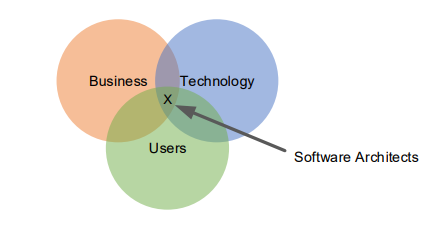

## What we will learn in this article 

-   What architects do
-   How knowing about software architecture will make you a better programmer and technical leader
-   How to get started on the path of becoming a software architect in your professional career

## What software architects do

Software architects have many responsabilities aside fom programming:

    1-   They define the problem from an engineering perspective

    2-   They devide the software systems into implementable chunks

    3-   Keep an eye on the big-picture to ensure the systems still works as a consistent whole

    4-   Decide tradeofs among quality attributs (the -ilities)

    5-   They manage the inivitable grouth of technical debt

    6-   They develop their teams architecture skills

Lets deep diver into what a software architect do:

### 1-  Define the problem from an engineering perspective

-   Software architecture design is a human-centered design
-   Everyone with a stake in the software can help understand what is expected of it
-   They work with product/project managers to define the business goals and requirements of the software

---

-   While product managers define features SAs keep an eye on another type of requirements called **Quality attributes**
-   They keep an eye on design constraints and features that might force the architecture down a specific path

### 2- Partition the system and assign responsabilities

### 3- Keep an eye on the bigger picture

Every Software system lives in the context of a bigger world

-   The users who interact with
-   The team that develops it
-   The hardware it runs on
-   The purpose of the software

<!--  -->
### 4- Decide Trade-offs among quality attributes

-   Example of a quality attribute is **high avalaibility**
    -   To have higher availability you can use redundancy
    -   you will have to buy more hardware
    -   costs will grow
    -   => Trade-off beween quality and costs

### 5- Manage technical Debt

-   Software architects know the details about how a system is partitioned
-   Thus they can keep an eye on the bigger picture and guide how everything comes together
-   They also connect Technology descisions with business needs
-   Knowing all this puts architects in the perfect position to manage technical debt.

---

**Technical debt:** is the gap between your software current design and the design you need it to have so you can keep delivering value

### 6- Grow the Team’s Architecture Skills

## What is a software architecture

A system's software architecture is the set of design descisions about how the software is organized to promote desired quality attributes and other properties (what are othe properties (??))

---
To **promote a quality attribute** means to encourage it to appear in the software system

### Define the essential structures

To create a structure, take any element and connect it to another element using a relation

-   elements and relations are the bricks and mortar of software
-   In this article we will define three types of elements and relations (**modules**, **Component and Connector C&C**, **Allocations**)

Lets define each one of these three elements:

<table style="width:100%">
  <tr>
  	<th></th>
    <th>Example Elements</th>
    <th>Example Relations</th>
  </tr>
  <tr>
    <td>Modules</td>
    <td>class, package, layer, module, configuration file, database table</td>
    <td>uses, allowed to use, depends on</td>
  </tr>
  <tr>
    <td>Component & connector</td>
    <td>object, connection, thread, process, tier, filter</td>
    <td>call, pipe, pulish, subscribe, return</td>
  </tr>
  <tr>
    <td>Allocations</td>
    <td>server, sensor, laptop, load balancer, team, A person, Docker container)</td>
    <td>runs in/on, responsible for, develops, stores, pays for</td>
  </tr>
</table>

-   **Module**:
    -   Elements that exist at design time
    -   You interact with them to write code
    -   They live in the filesystem
    -   They exist ven if the software is not running
-   **Component and connector**:

    -   These elements come into existance at runtime
    -   Cease to exist when the system is not running

-   **Allocations**:
    -   Created by showing how module and C&C elements correspond with each other and the physical elements that exist in real life.
    -   Allocations structures are sometitmes called mapping stuctures since they show how different element map to one another
    -   They allow us to answer questions like
        -   Does an element run in the client machine or the server
        -   Which teams are building which parts of the system

## Conclusion

-   Architects are not software managers but they get to decide when and how software is delivred
-   They make sure software meets its business goals.
-   They write code
-   They not only design algorithms and code but they are at the center of everything (Users, business, technology)
